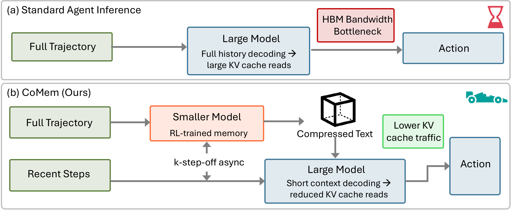
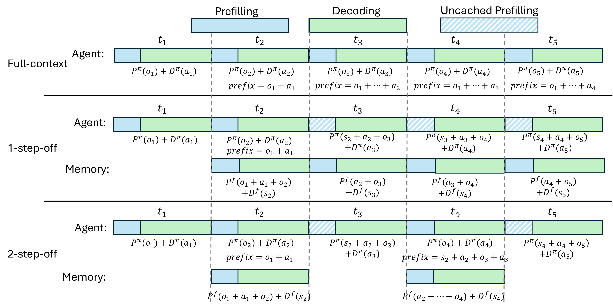
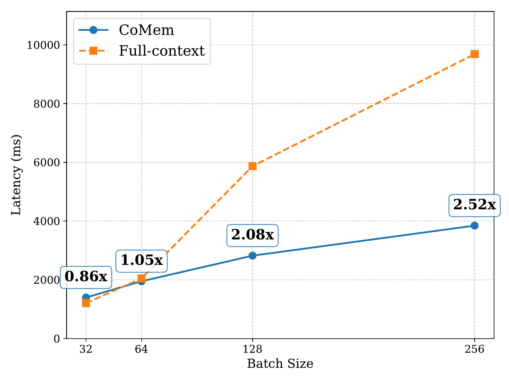

<h1 align="center">CoMem</h1>
<p align="center"><em>Context Management with A Decoupled Long-Context Model</em></p>

<p align="center">
  <a href="https://arxiv.org/abs/2605.30842">
    </a>
  &nbsp;
  <a href="https://github.com/horizon-llm/CoMem">
    </a>
  &nbsp;
  <a href="./LICENSE">
    </a>
</p>

`CoMem` is the official implementation for **CoMem: Context Management with A Decoupled Long-Context Model**, accepted to **ICML 2026**.

Context management enables agentic models to solve long-horizon tasks through iterative summarization of previous interaction histories. However, this process typically incurs substantial decoding overhead, which significantly affects end-to-end response latency at deployment. CoMem introduces a novel framework that **decouples memory management from the primary agent workflow**, enabling these processes to execute in parallel. We propose a *k*-step-off asynchronous pipeline that overlaps the memory model's summarization with the agent's inference, effectively masking the latency of context processing. To ensure robustness under this asynchronous setting, we introduce a reward-driven training strategy that aligns the memory model to capture sufficient statistics for the agent's decision-making.

<p align="center">
  
</p>
<p align="center"><em>CoMem framework: a decoupled agent framework that offloads long-context compression to an asynchronous, lightweight memory model, significantly reducing inference latency without compromising reasoning performance.</em></p>

# News
- [2026.05.26] Code released.

# Table of Contents

- [Overview](#overview)
- [Results](#results)
- [Installation](#installation)
- [Training](#training)
- [Evaluation](#evaluation)
- [Citation](#citation)

# Overview

The key insight behind CoMem is that reading and gathering information from long context is an "easier task" compared with complex decision-making. By offloading the heavy lifting of long-context processing to a dedicated, lightweight summarization model (Qwen3-4B), the main agent can decode with a significantly reduced context window.

**Key design choices:**

- **Decoupled Architecture:** A small memory model compresses the full interaction history into a compact state, while the larger agent model focuses solely on reasoning and policy generation.
- **_k_-step-off Asynchronous Pipeline:** The memory model continuously compresses history in the background, freeing the main agent to decode without waiting for summarization to complete.
- **Reward-Driven Alignment:** The memory model is trained using GRPO with an action-consistency reward that optimizes for *functional equivalence*---whether the compressed memory induces correct downstream behavior---rather than surface-level text quality.

<p align="center">
  
</p>
<p align="center"><em>Illustration of the k-step-off asynchronous pipeline. The memory model operates in the background while the agent continues execution, effectively masking the latency of context compression.</em></p>

The code in this repository supports:

- **Training** the CoMem context compressor with SFT warm-up and GRPO fine-tuning.
- **Evaluation** on SWE-Bench-Verified with multiple agent backbones (DeepSWE, Qwen3-Coder-Max, GLM-4.7).
- **Latency benchmarking** under various hardware configurations (GPU-only, CPU KV offloading).

# Results

We evaluate CoMem on SWE-Bench-Verified across three agent backbones. CoMem achieves **1.45x--2.08x speedup** under standard serving while preserving competitive resolve rates with the full-context baseline.

| Agent | Memory | %Resolved | Speedup (w/o CPU Offload) | Speedup (w/ CPU Offload) |
|-------|--------|-----------|---------------------------|--------------------------|
| **DeepSWE (32B)** | Full-Context | 40.4 | 1x | 1x |
| | CoMem (GRPO) | **41.0** | 1.68x | 1.45x |
| **Qwen3-Coder-Max (480B)** | Full-Context | **57.2** | 1x | 1x |
| | CoMem (GRPO) | 51.0 | 1.61x | 1.43x |
| **GLM-4.7 (355B)** | Full-Context | **69.0** | 1x | 1x |
| | CoMem (GRPO) | 62.7 | 1.92x | 2.08x |

Notably, on the DeepSWE backbone, CoMem (GRPO) achieves a **41.0% resolution rate**, slightly *surpassing* the full-context baseline (40.4%), suggesting that aligned summarization can effectively filter irrelevant noise for mid-sized models.

<p align="center">
  
</p>
<p align="center"><em>Latency and speedup results for GLM-4.7 over various batch sizes. CoMem's speedup scales favorably with increased throughput, achieving 2.52x at batch size 256.</em></p>

Furthermore, under high concurrency (64 concurrent requests), CoMem achieves up to **4.95x peak per-step speedup**, as its bounded prompt size avoids the KV cache saturation that causes latency explosion in full-context baselines.

# Installation

We provide the following docker environment:
```bash
docker run --gpus all --shm-size=64g --rm -it --net=host \
 --entrypoint /usr/bin/bash \
 brandonzyw/comem:v1
```
The docker image includes two conda environments:
- `verl-agent` — for training (`conda activate verl-agent`)
- `r2e-gym` — for evaluation (`conda activate r2e-gym`)

# Training

We provide training scripts for the CoMem context compressor in [`training/examples/`](training/examples/).

Before running, set your Weights & Biases API key:
```bash
export WANDB_API_KEY=<your-wandb-api-key>
```

## SFT (Warm-up)
```bash
bash training/examples/sft_sum_trainer/run_qwen3_4b.sh
```

## GRPO (RL Fine-tuning)
```bash
# SWE-bench with GLM-4.7 as the agent LLM
bash training/examples/grpo_sum_trainer/run_swebench_qwen3_4b_glm_pv5_2048_v2_grp16.sh
```
```bash
# SWE-bench with DeepSWE as the agent LLM
bash training/examples/grpo_sum_trainer/run_swebench_qwen3_4b_deepswe_pv5_2048_v2_grp16.sh
```
```bash
# SWE-bench with Qwen3-Coder-480B as the agent LLM
bash training/examples/grpo_sum_trainer/run_swebench_qwen3_4b_qmax_pv5_2048_v2_grp16.sh
```
```bash
# BrowseComp with GLM-4.7 as the agent LLM
bash training/examples/grpo_sum_trainer/run_browsecomp_qwen3_4b_glm_pv5_2048_v2_grp16.sh
```

# Evaluation

We provide evaluation scripts in [`evaluation/scripts/`](evaluation/scripts/).

## Step 1: Start the Agent LLM Server
```bash
bash evaluation/scripts/start_vllm_server_glm.sh      # GLM-4.7
bash evaluation/scripts/start_vllm_server_deepswe.sh   # DeepSWE
bash evaluation/scripts/start_vllm_server_qmax.sh      # Qwen3-Coder-480B
```

## Step 2 (CoMem only): Start the Memory Model Server
```bash
bash evaluation/scripts/start_vllm_server_mem.sh       # Memory model (Qwen3-4B compressor)
```

## Step 3: Run Evaluation

### CoMem (Ours)
```bash
bash evaluation/scripts/eval_comem_kso_glm.sh          # SWE-bench + GLM-4.7
bash evaluation/scripts/eval_comem_kso_deepswe.sh      # SWE-bench + DeepSWE
bash evaluation/scripts/eval_comem_kso_qmax.sh         # SWE-bench + Qwen3-Coder-480B
```

### Full-Context Baseline
```bash
bash evaluation/scripts/eval_full_context_glm.sh       # SWE-bench + GLM-4.7
bash evaluation/scripts/eval_full_context_deepswe.sh   # SWE-bench + DeepSWE
bash evaluation/scripts/eval_full_context_qmax.sh      # SWE-bench + Qwen3-Coder-480B
```

### BrowseComp

Start the GLM-4.7 server with 128k context for BrowseComp:
```bash
bash evaluation/scripts/start_vllm_server_glm_cpu_128k.sh
```

Set required environment variables:
```bash
export SERPER_API_KEY=<your-serper-api-key>
export OPENAI_API_KEY=<your-openai-api-key>
```
```bash
bash evaluation/scripts/eval_comem_miroflow_browsecomp_en.sh  # CoMem + GLM-4.7
bash evaluation/scripts/eval_miroflow_browsecomp_en.sh        # Full-context + GLM-4.7
```

### Latency Benchmarks
```bash
# CoMem latency
bash evaluation/scripts/eval_comem_kso_glm_lat.sh
bash evaluation/scripts/eval_comem_kso_deepswe_lat.sh
bash evaluation/scripts/eval_comem_kso_qmax_lat.sh

# CoMem latency with CPU KV offloading
bash evaluation/scripts/eval_comem_kso_glm_lat_cpuoffload.sh
bash evaluation/scripts/eval_comem_kso_deepswe_lat_cpuoffload.sh
bash evaluation/scripts/eval_comem_kso_qmax_lat_cpuoffload.sh

# Full-context latency
bash evaluation/scripts/eval_full_context_glm_lat.sh
bash evaluation/scripts/eval_full_context_deepswe_lat.sh
bash evaluation/scripts/eval_full_context_qmax_lat.sh

# Full-context latency with CPU KV offloading
bash evaluation/scripts/eval_full_context_glm_lat_cpu.sh
bash evaluation/scripts/eval_full_context_deepswe_lat_cpu.sh
bash evaluation/scripts/eval_full_context_qmax_lat_cpu.sh
```

# Acknowledgement

We gratefully acknowledge the contributions of the [veRL](https://github.com/volcengine/verl) team for providing a solid RL infrastructure.

Special thanks to the [R2E-Gym](https://github.com/R2E-Gym/R2E-Gym) and [verl-agent](https://github.com/langfengQ/verl-agent) projects for their codebase, which inspired early design choices during the development of CoMem.

# Citation

If you find `CoMem` useful in your research or applications, we would appreciate it if you could cite our work:

```bibtex
@inproceedings{zhang2026comem,
  title={CoMem: Context Management with A Decoupled Long-Context Model},
  author={Zhang, Yuwei and Dong, Chengyu and Jin, Shuowei and Yu, Changlong and Cui, Hejie and Jin, Hongye and Zhang, Xinyang and Bonab, Hamed and Lockard, Colin and Chen, Jianshu and Shi, Zhenyu and Shang, Jingbo and Li, Xian and Yin, Bing},
  booktitle={International Conference on Machine Learning (ICML)},
  year={2026}
}
```

We're excited to share our results and welcome feedback from the community. If you have any questions, please feel free to contact us at [yuz163@ucsd.edu](mailto:yuz163@ucsd.edu).
